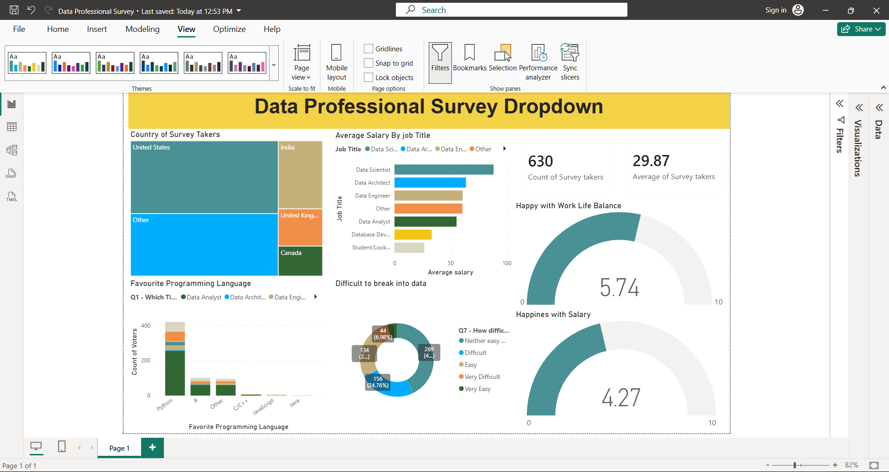

# PowerBI-Data-Professional-Survey-Dashboard
An interactive Power BI dashboard analyzing responses from a Data Professional Survey.

## Overview

This project presents an interactive Power BI dashboard built using a Data Professional Survey dataset. The dashboard analyzes survey responses from professionals across different countries, providing insights into salaries, programming language preferences, work-life balance, and career satisfaction.

---

## Dashboard Preview

---

## Project Objectives

- Analyze survey responses from data professionals.
- Compare average salaries across different job roles.
- Identify the most popular programming languages.
- Evaluate work-life balance and salary satisfaction.
- Understand the difficulty of breaking into the data industry.

---

## Dashboard Features

### 📍 KPIs
- Total Survey Respondents
- Average Age of Survey Respondents

### 🌍 Geographic Analysis
- Country-wise distribution of survey participants

### 💼 Salary Analysis
- Average Salary by Job Title

### 💻 Programming Languages
- Favorite programming language by profession

### 😊 Employee Satisfaction
- Work-Life Balance Score
- Salary Happiness Score

### 📈 Career Insights
- Difficulty of Breaking into Data

---

## Tools & Technologies

- Power BI
- Power Query
- DAX
- Microsoft Excel

---

## Skills Demonstrated

- Data Cleaning
- Data Transformation
- Data Modeling
- DAX Measures
- Dashboard Design
- Business Intelligence
- Data Visualization

---

## Dataset

Data Professional Survey Dataset

The dataset contains responses from professionals including:

- Country
- Job Title
- Salary
- Programming Language
- Work-Life Balance
- Salary Satisfaction
- Age
- Difficulty Breaking into Data

---

## Key Insights

- Data Scientists earn the highest average salary among surveyed roles.
- Python is the most preferred programming language.
- Most respondents reported positive work-life balance.
- Breaking into the data industry is considered difficult by many participants.

---

- Excel
- Power BI
- Python
